  

## 👨‍💻 About

  

## ⚡ Skills

  
    
  

## 🚀 Featured Projects

<table>
  <tr>
    <td width="50%">
      
    </td>
    <td width="50%">
      
    </td>
  </tr>
  <tr>
    <td width="50%">
      
    </td>
    <td width="50%">
      
    </td>
  </tr>
</table>

[**View all repositories →**](https://github.com/probal2005?tab=repositories)

## 📊 GitHub Stats (live)

## 📈 Contributions

 

<picture>
  <source
    media="(prefers-color-scheme: dark)"
    srcset="https://raw.githubusercontent.com/Probal2005/Probal2005/output/github-snake-dark.svg"
  />
  <source
    media="(prefers-color-scheme: light)"
    srcset="https://raw.githubusercontent.com/Probal2005/Probal2005/output/github-snake.svg"
  />
  
</picture>

## 🔄 Recent Activity (auto-updated)

<!--START_SECTION:activity-->
<!--END_SECTION:activity-->

