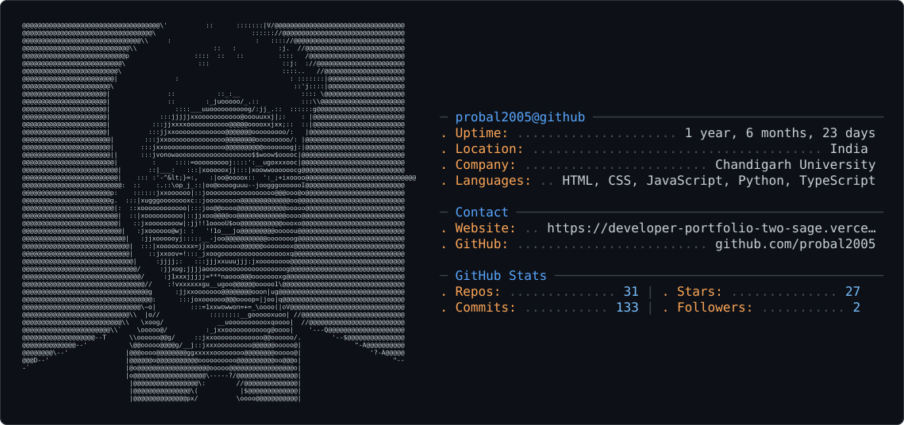

<picture>
  <source media="(prefers-color-scheme: dark)" srcset="dark_mode.svg" />
  <source media="(prefers-color-scheme: light)" srcset="light_mode.svg" />
  
</picture>

---

# 👨‍💻 About Me


### 🚀 Who Am I?

🎓 **B.Tech CSE (Artificial Intelligence & Machine Learning)**  
🏫 **Chandigarh University**

💻 Passionate Full Stack Developer who loves building beautiful web applications and AI-powered solutions.

🤖 Interested in

- Artificial Intelligence
- Machine Learning
- Deep Learning
- Computer Vision
- Natural Language Processing
- Web Development
- Open Source
- Linux

🌱 Currently Learning

- Advanced Machine Learning
- Computer Vision
- Deep Learning
- System Design
- Docker
- Cloud Computing

💬 Ask me about

- Python
- JavaScript
- React
- HTML
- CSS
- AI & ML
- Git
- Linux

⚡ Fun Fact

> I love turning creative ideas into real-world software and continuously learning new technologies.

---

# 🌐 Connect With Me

<div align="center">

<a href="https://github.com/Probal2005">

</a>

<a href="https://probal2005.github.io">

</a>

</div>

---

# 💻 Tech Stack

## 🚀 Programming Languages

<p>


</p>

---

## 🌐 Frontend

<p>


</p>

---

## ⚙️ Backend

<p>


</p>

---

## 🗄️ Database

<p>


</p>

---

## 🤖 AI / ML

<p>


</p>

---

## 🛠️ Tools

<p>


</p>

---

<div align="center">

### 💡 "Code. Learn. Build. Share. Repeat."


</div>
---

# 📊 GitHub Dashboard

<div align="center">


</div>

---

# 📈 Most Used Languages

<div align="center">


</div>

---

# 🏆 GitHub Trophies

<div align="center">


</div>

---

# 📈 Contribution Graph

<div align="center">


</div>

---

# 🐍 Contribution Snake

<div align="center">


</div>

> **Note:** The snake animation requires a GitHub Action in your profile repository to generate automatically.

---

# 📅 Coding Activity

<div align="center">


</div>

---

# 📊 GitHub Summary Cards

<div align="center">


### 💼 Some of my favorite projects

*Building AI-powered applications, modern websites, and useful software solutions.*

</div>

---

<table>

<tr>

<td width="50%">

### 🌐 Portfolio Website

Personal portfolio showcasing my projects, skills, experience and achievements.

**Tech Stack**

`HTML` `CSS` `JavaScript`

**Repository**

https://github.com/Probal2005/probal2005.github.io

</td>

<td width="50%">

### 🤖 AI Resume Pro

AI-powered Resume Builder that helps users create professional resumes.

**Tech Stack**

`React` `JavaScript` `CSS`

**Repository**

https://github.com/Probal2005/ai-resume-pro

</td>

</tr>

<tr>

<td>

### 🏥 MediCore

Healthcare Management System with modern UI and advanced features.

**Tech Stack**

`HTML`
`CSS`
`JavaScript`

**Repository**

https://github.com/Probal2005/MediCore

</td>

<td>

### 🛒 NexMart

Modern responsive E-Commerce Website.

**Tech Stack**

`HTML`
`CSS`
`JavaScript`

**Repository**

https://github.com/Probal2005/NexMart

</td>

</tr>

<tr>

<td>

### 🚪 NexDoor

Smart Community Management Website.

**Tech Stack**

`HTML`
`CSS`
`JavaScript`

**Repository**

https://github.com/Probal2005/NexDoor

</td>

<td>

### 🌍 Digital World Clock

A beautiful multi-timezone digital clock.

**Tech Stack**

`HTML`
`CSS`
`JavaScript`

**Repository**

https://github.com/Probal2005/Digital-World-Clock

</td>

</tr>

<tr>

<td>

### 📚 Open Library

Online Library Management System with modern interface.

**Tech Stack**

`Python`
`Flask`
`SQLite`

**Repository**

https://github.com/Probal2005

</td>

<td>

### 👤 Face Recognition Attendance

AI-based Student Attendance System using Face Recognition.

**Tech Stack**

`Python`
`OpenCV`
`Machine Learning`

**Repository**

https://github.com/Probal2005/Student-Attendance-System-using-Face-Recognition

</td>

</tr>

<tr>

<td>

### 📄 IEEE Paper HTML Template

Professional IEEE Paper Template built using HTML & CSS.

**Tech Stack**

`HTML`
`CSS`

**Repository**

https://github.com/Probal2005/ieee-paper-html-template

</td>

<td>

### 💼 Resume Templates

Collection of modern professional resume templates.

**Tech Stack**

`HTML`
`CSS`

**Repository**

https://github.com/Probal2005/resume-3Page-modern

</td>

</tr>

<tr>

<td>

### 🎨 JavaScript Projects

Collection of interactive JavaScript mini projects.

**Tech Stack**

`HTML`
`CSS`
`JavaScript`

**Repository**

https://github.com/Probal2005/JavaScript-Projects

</td>

<td>

### 🤖 AI & Research Projects

Innovative AI, ML, and research-based experimental projects.

**Topics**

Artificial Intelligence

Machine Learning

Computer Vision

Deep Learning

Open Source

</td>

</tr>

</table>

---

# ⭐ Favorite Repositories

|

---

# 🏆 Achievements

<div align="center">

🥇 B.Tech Student (Computer Science Engineering - AI & ML)

🤖 Passionate Artificial Intelligence & Machine Learning Developer

💻 Full Stack Web Developer

🚀 Open Source Contributor

🌐 50+ Web Development Projects

📚 Continuous Learner

🔬 AI Research Enthusiast

🎯 Building Real-World Software Solutions

</div>

---

# 🎯 Current Focus

```text
🤖 Artificial Intelligence
████████████████████ 100%

🧠 Machine Learning
██████████████████░░ 90%

🌐 Full Stack Development
██████████████████░░ 90%

⚛️ React Development
█████████████████░░░ 85%

🐍 Python Development
████████████████████ 100%

🐧 Linux
██████████████████░░ 90%

☁️ Cloud Computing
██████████████░░░░░░ 70%

🐳 Docker
█████████████░░░░░░░ 65%
```

---

# 📚 Currently Learning

- 🤖 Artificial Intelligence
- 🧠 Deep Learning
- 👁 Computer Vision
- 💬 Natural Language Processing
- ⚛️ Advanced React
- 🐳 Docker
- ☁️ Cloud Computing
- 🔐 Cyber Security
- ⚙️ System Design
- 📊 Data Science

---

# 🌟 Goals for 2026

- ✅ Build impactful AI applications
- ✅ Contribute to Open Source regularly
- ✅ Publish research projects
- ✅ Master Full Stack Development
- ✅ Learn Cloud & DevOps
- ✅ Solve 500+ coding problems
- ✅ Create developer tools
- ✅ Grow my GitHub portfolio
- ✅ Collaborate on innovative projects

---

# 💼 Services

✔️ AI & Machine Learning Projects

✔️ Portfolio Websites

✔️ Responsive Web Applications

✔️ Python Development

✔️ React Development

✔️ Frontend UI Design

✔️ Backend Development

✔️ API Integration

✔️ Open Source Contributions

---

# 💡 Fun Facts

- ☕ Coffee makes coding more enjoyable.
- 💻 I enjoy building creative web applications.
- 🤖 I love exploring AI and Machine Learning.
- 🌍 I enjoy learning new technologies.
- 🚀 Every project teaches me something new.
- 📚 I believe learning never stops.

---

# 📫 Connect With Me

<div align="center">

<a href="https://github.com/Probal2005">

</a>

<a href="https://probal2005.github.io">

</a>

</div>

---

# ❤️ Support My Work

If you like my projects and find them useful:

⭐ Star my repositories

🍴 Fork my projects

👨‍💻 Follow me on GitHub

💬 Share feedback and ideas

🤝 Let's collaborate on exciting projects!

---

<div align="center">

# 💖 Thank You for Visiting!


### ⭐ Don't forget to Star your favorite repositories!


</div>
